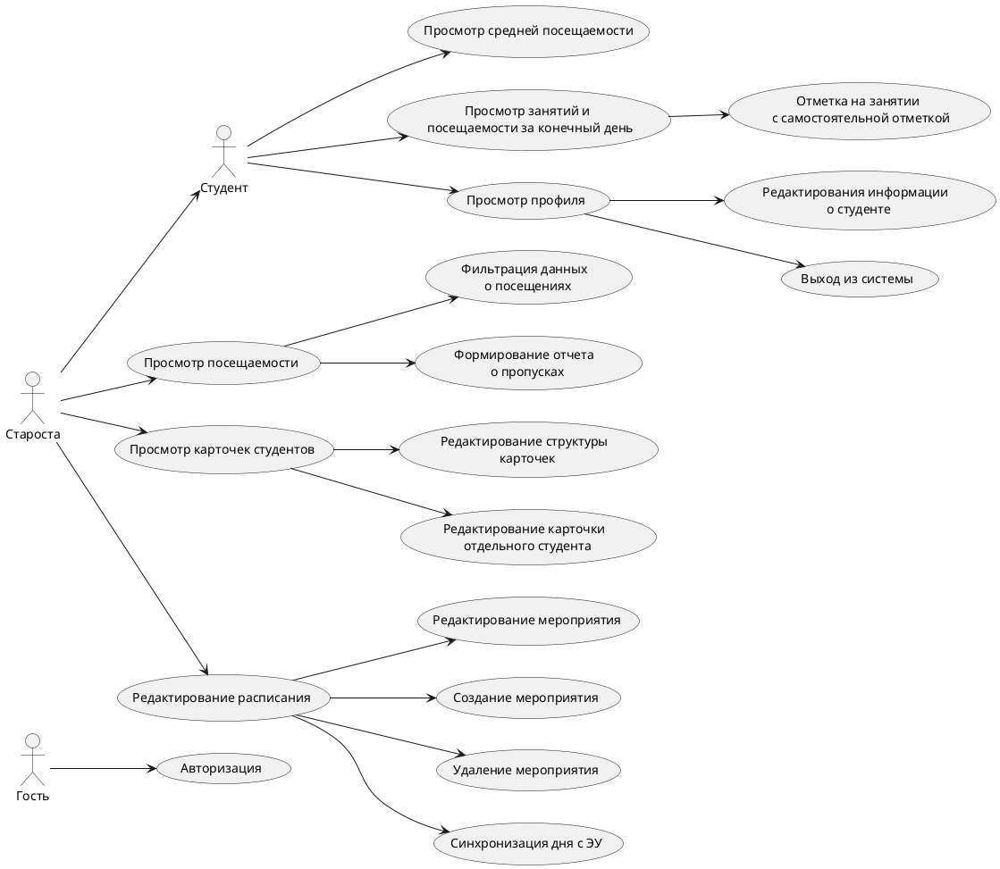
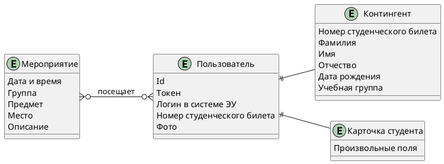

# Электронный журнал старосты

В связи с не поддержкой кафедральным гитлабом plantuml, также к просмотру предлагается  [отрендеренный pdf](./readme.pdf)

## Содержание
<!-- vscode-markdown-toc -->
- [Электронный журнал старосты](#электронный-журнал-старосты)
  - [Содержание](#содержание)
  - [Цель работы](#цель-работы)
  - [Решаемая проблема/предоставляемая возможность.](#решаемая-проблемапредоставляемая-возможность)
  - [Краткий перечень функциональных требований](#краткий-перечень-функциональных-требований)
  - [USE-CASE - диаграмма](#use-case---диаграмма)
  - [Экраны будущего приложения](#экраны-будущего-приложения)
  - [ER-диаграмма](#er-диаграмма)
- [API](#api)
  - [Пользователь](#пользователь)
  - [Задачи](#задачи)
  - [Группы](#группы)
  - [Произвольные поля](#произвольные-поля)
  - [Событие](#событие)
  - [Посещение](#посещение)
  - [Студенты](#студенты)
  - [Статистика](#статистика)

<!-- vscode-markdown-toc-config
	numbering=false
	autoSave=true
	/vscode-markdown-toc-config -->
<!-- /vscode-markdown-toc -->

## Цель работы

Разработка ПО для упрощения видения журнала старосты

## Решаемая проблема/предоставляемая возможность.

автоматизации процессов формирования отчетности о посещаемости сокращает время старосты, во время подготовки отчетов для смотров

## Краткий перечень функциональных требований

- заполнение информации о посещениях студентами
- формирование отчетов о посещаемости
- ведение личных карточек студентов с пользовательскими полями
- предоставление студенту интерфейса о его посещаемости и расписании занятий
- возможность отметиться на онлайн занятии.
- авторизация через CAS МГТУ
- поддержка интеграции с ЭУ

## USE-CASE - диаграмма

## Экраны будущего приложения

Ссылка на FIGMA: https://www.figma.com/file/gBFDw5OJIFQ1Zu29Ncq1Rr/IU7RF

## ER-диаграмма

# API

Группа одна у пользователя

## Пользователь
GET /auth/
GET /auth/cas
GET /auth/user

## Задачи 
POST /rpc/syncTimetable -- синхронизировать расписание

## Группы
GET /groups
GET /groups/{groupId}

## Произвольные поля
GET /groups/{groupId}/fields
PUT /groups/{groupId}/fields

## Событие
GET /groups/{groupId}/events
POST /groups/{groupId}/events
GET /groups/{groupId}/events/{eventId}
PUT /groups/{groupId}/events/{eventId}

## Посещение
PUT  /groups/{groupId}/events/{eventId}/visits -- полное изменение 
PATCH /groups/{groupId}/events/{eventId}/visits -- посетить текущим пользователем

## Студенты
GET /groups/{groupId}/users
PATCH /groups/{groupId}/users/{userId}/student_card -- обновить

## Статистика
GET /groups/{groupId}/statistics
GET /groups/{groupId}/users/{userId}/statistics

---------------

