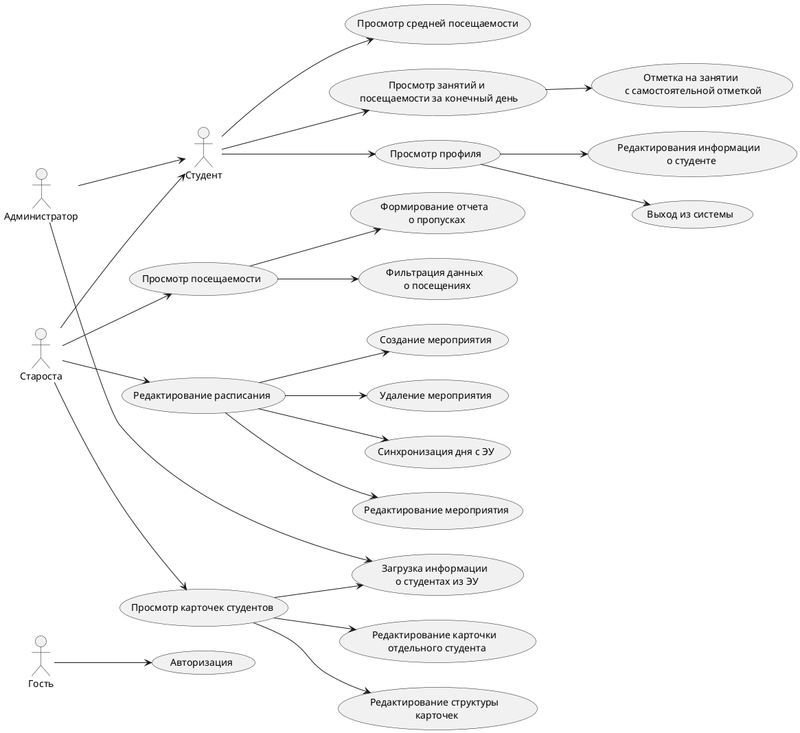
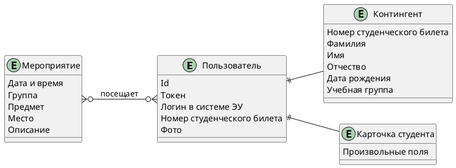
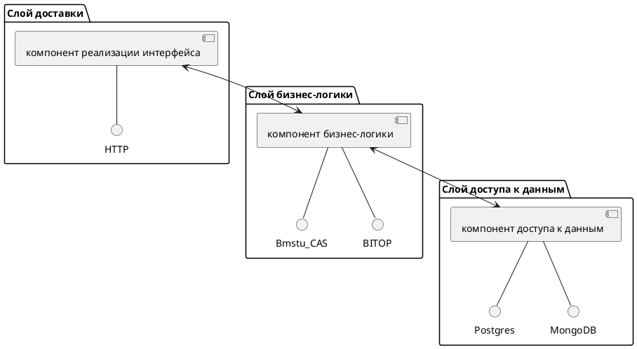
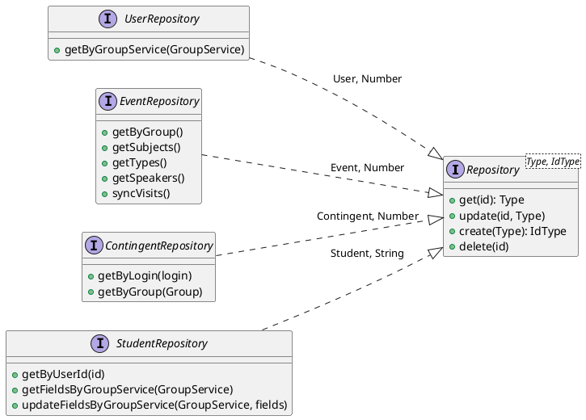
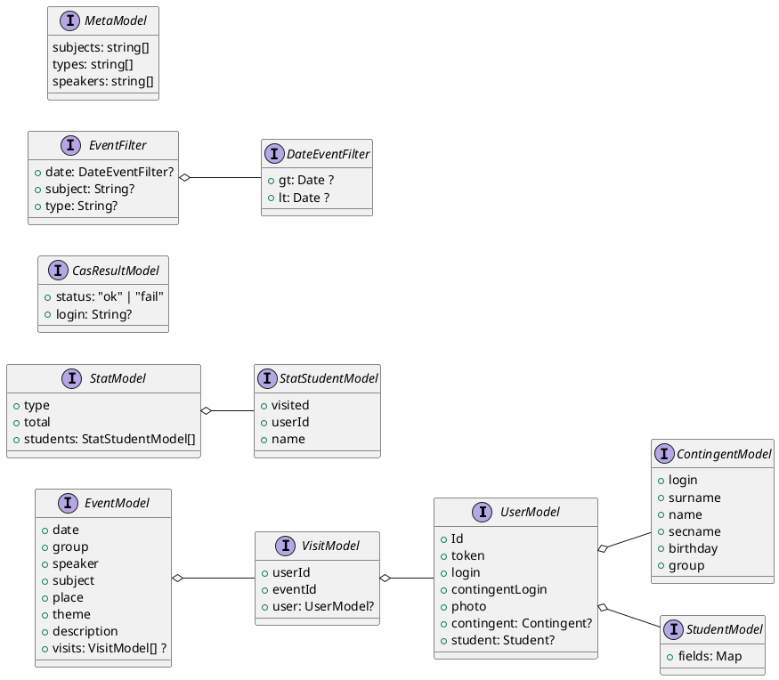
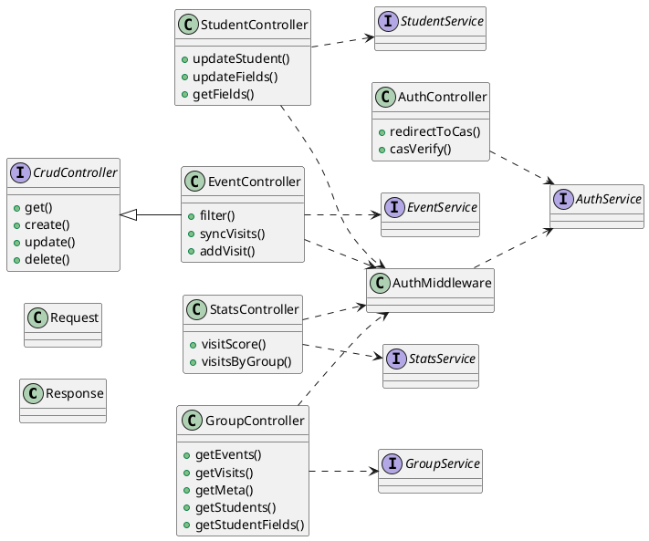

# Электронный журнал старосты

В связи с неподдержкой кафедральным гитлабом plantuml, также к просмотру предлагается  [отрендеренный pdf](./readme.pdf)

## Содержание
<!-- vscode-markdown-toc -->
- [Электронный журнал старосты](#электронный-журнал-старосты)
  - [Содержание](#содержание)
  - [ЛР1](#лр1)
    - [Название проекта](#название-проекта)
    - [Описание идеи проекта](#описание-идеи-проекта)
    - [Описание предметной области](#описание-предметной-области)
    - [Краткий анализ аналогичных решени](#краткий-анализ-аналогичных-решени)
    - [Целесообразность и актуальность проблемы](#целесообразность-и-актуальность-проблемы)
    - [USE-CASE - диаграмма](#use-case---диаграмма)
    - [ER-диаграмма](#er-диаграмма)
    - [Архитектурные характеристики](#архитектурные-характеристики)
  - [ЛР2](#лр2)
    - [Описание типа приложения и выбранного технологического стека](#описание-типа-приложения-и-выбранного-технологического-стека)
    - [Верхнеуровневое разбиение на компоненты](#верхнеуровневое-разбиение-на-компоненты)
    - [UML диаграмма классов компонента с бизнес-логикой.](#uml-диаграмма-классов-компонента-с-бизнес-логикой)
    - [UML диаграмма компонента доступа к данным.](#uml-диаграмма-компонента-доступа-к-данным)
    - [UML диаграммы «модельных» классов сущностей: сущности базы данных, сущности системы и транспортные сущности.](#uml-диаграммы-модельных-классов-сущностей-сущности-базы-данных-сущности-системы-и-транспортные-сущности)
  - [ЛР5](#лр5)
    - [UML-диаграммы классов для компонента/модуля, связывающего GUI и бизнес-логику и компонента/модуля GUI](#uml-диаграммы-классов-для-компонентамодуля-связывающего-gui-и-бизнес-логику-и-компонентамодуля-gui)
  - [ЛР6](#лр6)
    - [Уточненная UML-диаграмма компонентов для всего приложения](#уточненная-uml-диаграмма-компонентов-для-всего-приложения)

<!-- vscode-markdown-toc-config
	numbering=false
	autoSave=true
	/vscode-markdown-toc-config -->
<!-- /vscode-markdown-toc -->


## ЛР1


### Название проекта

Электронный журнал старосты 

### Описание идеи проекта

Заполнение информации о посещениях студентами, формирование отчетов о посещаемости, ведение личных карточек студентов с пользовательскими полями, предоставление студенту интерфейсу о его посещаемости и расписании занятий, возможность отметиться на онлайн занятии.

### Описание предметной области

Журнал старосты необходим для отметки посещаемости и тем занятий. 

### Краткий анализ аналогичных решени
 
**Карточка студента** - карточка с возможностью добавления произвольных полей

**Календарь** - календарь со всеми мероприятиями курса

**Посещаемость** - контроль посещаемости мероприятий

||Карточка студента|Календарь|Посещаемость|Синхронизация с ЭУ|
|----|----|----|---|---|
|Moodle| + | + | - | Частичная* | 
|ISpring| - | + | - | Частичная* | 
|Miropolis| - | + | + | ? | 

* \* интеграция с CAS 


### Целесообразность и актуальность проблемы

автоматизации процессов формирования отчетности о посещаемости сокращает время старосты, во время подготовки отчетов для смотров

### USE-CASE - диаграмма



### ER-диаграмма


### Архитектурные характеристики
- предоставление REST API
- авторизация через CAS МГТУ
- поддержка интеграции с ЭУ

## ЛР2

###  Описание типа приложения и выбранного технологического стека

**Тип приложения**: Backend REST JSON

**Стек**: Node.js + Express.js + Postgres + MongoDB


### Верхнеуровневое разбиение на компоненты




### UML диаграмма классов компонента с бизнес-логикой. 


```plantuml

interface AuthService {
    +auth()
    +checkToken()
}

interface StudentService {
    +allByGroupService()
    +updateStudent()
    +updateFields()
}


interface EventService {
    +create()
    +update()
    +delete()
    +filter()
    +syncVisits()
    +addVisit()
    +syncDay()
}

EventService ..> EventSyncService

interface StatsService {
    +visitScore()
    +visitsByGroupService()
}


interface GroupService {
    + getEvents()
    + getVisits()
    + getMeta()
    + getStudents()
    + getStudentFields()
}


interface CasService {
    + generateLink()
    + checkToken()
}

interface EventSyncService {
    + getEvents()
}

```

### UML диаграмма компонента доступа к данным. 





### UML диаграммы «модельных» классов сущностей: сущности базы данных, сущности системы и транспортные сущности.



## ЛР5

Технологический UI собран с помощью Swagger


### UML-диаграммы классов для компонента/модуля, связывающего GUI и бизнес-логику и компонента/модуля GUI





## ЛР6

### Уточненная UML-диаграмма компонентов для всего приложения

```plantuml
@startuml
' !theme plain

left to right direction

skinparam linetype ortho
skinparam groupInheritance 2

skinparam nodesep 80
skinparam ranksep 80

package services {

    interface AuthService {
        +auth()
        +checkToken()
    }


    interface StudentService {
        +allByGroupService()
        +updateStudent()
        +updateFields()
    }


    interface EventService {
        +create()
        +update()
        +delete()
        +filter()
        +syncVisits()
        +addVisit()
    }

    EventService ..> EventSyncService

    interface StatsService {
        +visitScore()
        +visitsByGroupService()
    }


    interface GroupService {
        + getEvents()
        + getVisits()
        + getMeta()
        + getStudents()
        + getStudentFields()
        + syncDay()
    }


    interface CasService {
        + generateLink()
        + checkToken()
    }

    interface EventSyncService {
        + getEvents()
    }


    interface UserModel {
        + Id
        + token
        + login
        + contingentLogin
        + photo
        + contingent: Contingent?
        + student: Student?
    }

    UserModel o-- ContingentModel
    UserModel o-- StudentModel
    interface ContingentModel {
        + login
        + surname
        + name
        + secname
        + birthday
        + group
    }

    interface StudentModel {
        + fields: Map
    }

    interface EventModel {
        + date
        + group
        + speaker
        + subject
        + place
        + theme
        + description
        + visits: VisitModel[] ?
    }

    EventModel o-- VisitModel

    interface VisitModel {
        + userId
        + eventId
        + user: UserModel?
    }

    VisitModel o-- UserModel


    interface StatModel {
        + type
        + total
        + students: StatStudentModel[]
    }

    interface StatStudentModel {
        + visited
        + userId
        + name
    }

    interface CasResultModel {
        + status: "ok" | "fail"
        + login: String?
    }


    interface EventFilter {
        + date: DateEventFilter?
        + subject: String?
        + type: String?
    }
    EventFilter o-- DateEventFilter
    interface DateEventFilter {
        + gt: Date ?
        + lt: Date ?
    }

    StatModel o-- StatStudentModel


    interface MetaModel {
        subjects: string[]
        types: string[]
        speakers: string[]
    }

}


package Repositories {
    interface Repository<Type, IdType> {
        +get(id): Type
        +update(id, Type)
        +create(Type): IdType
        +delete(id)
    }

    interface UserRepository {
        +getByGroupService(GroupService)
    }

    ' UserRepository ..|> Repository : User, Number
    UserRepository ..|> Repository

    interface EventRepository {
        +getByGroup()
        +getSubjects()
        +getTypes()
        +getSpeakers()
        +syncVisits()
    }

    ' EventRepository ..|> Repository: Event, Number
    EventRepository ..|> Repository


    interface ContingentRepository {
        +getByLogin(login)
        +getByGroup(Group)
    }

    ' ContingentRepository ..|> Repository: Contingent, Number
    ContingentRepository ..|> Repository




    interface StudentRepository {
        +getByUserId(id)
        +getFieldsByGroupService(GroupService)
        +updateFieldsByGroupService(GroupService, fields)
    }
    ' StudentRepository ..|> Repository: Student, String
    StudentRepository ..|> Repository
}


package Transport {
    class AuthMiddleware
    AuthMiddleware ..> AuthService


    class AuthController {
        +redirectToCas()
        +casVerify()
    }



    AuthController ..> AuthService
    AuthController ..> CasService

    StudentController ..> AuthMiddleware
    class StudentController {
        +updateStudent()
        +updateFields()
        +getFields()
    }
    StudentController ..> StudentService

    interface CrudController {
        +get()
        +create()
        +update()
        +delete()
    }

    EventController ..> AuthMiddleware
    class EventController extends CrudController {
        +filter()
        +syncVisits()
        +addVisit()
    }

    EventController ..> EventService


    class StatsController {
        +visitScore()
        +visitsByGroup()
    }

    StatsController ..> AuthMiddleware
    StatsController ..> StatsService

    GroupController ..> AuthMiddleware
    class GroupController {
        + getEvents()
        + getVisits()
        + getMeta()
        + getStudents()
        + getStudentFields()
    }

    GroupController ..> GroupService


    class ContingentMiddleware
}

package Iu7Services {

    class BitopEventSyncService implements EventSyncService {

    }


    class BmstuCasService implements CasService {

    }

    BmstuCasService ..> CasHttpClient
    BmstuCasService ..> CasXmlParser

    interface TokenCreator

    class Iu7TokenCreator implements TokenCreator
    interface CasHttpClient
    interface CasXmlParser
    class AxiosCasHttpClient implements CasHttpClient {

    }

    class FastXmlParser implements CasXmlParser {

    }



    class Iu7AuthService implements AuthService {

    }

    Iu7AuthService ..> CasService
    Iu7AuthService ..> UserRepository
    Iu7AuthService ..> TokenCreator


    class Iu7EventService implements EventService {

    }

    Iu7EventService ..> EventRepository

    class Iu7GroupService implements GroupService

    Iu7GroupService ..> EventRepository
    Iu7GroupService ..> UserRepository
    Iu7GroupService ..> StudentRepository
    Iu7GroupService ..> EventSyncService

    class Iu7StatsService implements StatsService

    Iu7StatsService ..> EventRepository
    Iu7StatsService ..> UserRepository

    class Iu7StudentService implements StudentService

    Iu7StudentService ..> StudentRepository

}

circle FastXml
circle Axios

FastXmlParser ..> FastXml
AxiosCasHttpClient ..> Axios

GroupController ..> ContingentMiddleware

EventService ..> EventModel
EventService ..> EventFilter

CasService ..> CasResultModel

GroupService ..> MetaModel

StatsService ..> StatModel

' circle Express
' circle Inversify
' circle InversifyExpressUtils
InversifyExpressUtils .u.> Express
InversifyExpressUtils .u.> Inversify

InversifyExpressUtils ..> AuthController
InversifyExpressUtils ..> EventController
InversifyExpressUtils ..> GroupController
InversifyExpressUtils ..> StatsController

package Iu7Repositories {

    class MongoStudentRepository implements StudentRepository
    class SqlContingentRepository implements ContingentRepository
    class SqlEventRepository implements EventRepository
    class SqlUserRepository implements UserRepository

}
circle Mongo::Db

MongoStudentRepository ..> Mongo::Db

circle Knex

SqlContingentRepository ..> Knex
SqlEventRepository ..> Knex
SqlUserRepository ..> Knex

@enduml
```

